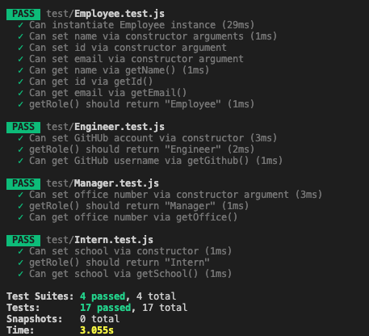
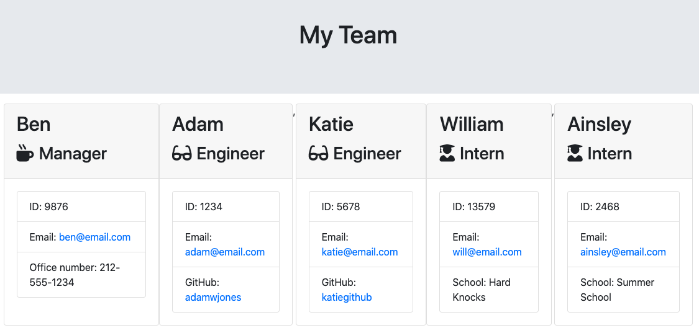

# Team Template Engine  

## Watch video here
https://youtu.be/v9AqPGvPfec

## Description
This project helps team leaders and managers quickly generate an outline of their team using command line prompts. The application will prompt the user for information about the team manager and then information about the team members. The user can input any number of team members, and they may be a mix of engineers and interns. When the user has completed building the team, the application creates an HTML file that displays a nicely formatted team roster based on the information provided by the user

This application passed all unit tests. Please refer to the table of contents for more information on this app. Enjoy. 

## Table of Contents

- [Description](#description)
- [Installation](#installation)
- [Usage](#usage)
- [Contribution](#contribution)
- [Test](#test)
- [License](#license)
- [Questions](#questions) 
- [Screenshots](#screenshots)

### Installation
Please follow these unique installation instructions (if necessary): Make sure to run npm install and all dependencies

### Usage
This application’s code is free to use following the terms of the license identified. Additional usage instructions are: Same as license 

### Contribution
This applicating was made by Adam Jones with the assistance of Leigh (our amazing TA for the Rutgers Full Stack Coding Bootcamp). 

### Test 
I would not trust my code (or any code) without testing it myself. Please consider performing the following testing on this application prior to use: Take a look to validate that it worked before blindly pushing it to GitHub

### License               
This application is covered under the terms of the Artistic License 2.0 
Pease refer to their site for more details of the terms of use permittable.

### Questions

* If you have any questions or comments regarding this project, please contact me at adam.w.jones2@gmail.com and I will try to reply as soon as possible. 

* If you liked this project, please check out my GitHub page at adamwjones to see more of my work.

### Screenshots

* Test results:

* UI Output 

